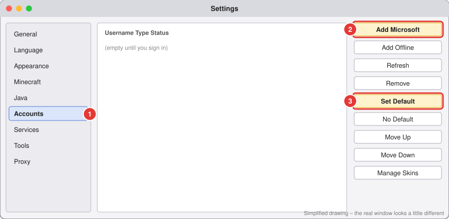

# 2. Sign in with your Microsoft account

⏱️ About 3 minutes.

**Before you start:** you need a Microsoft account that **owns Minecraft: Java Edition**. You buy it at [minecraft.net](https://www.minecraft.net). PC Game Pass also includes it. If you only have Minecraft on a phone, console or Bedrock, that is a **different** game and won't work here.

## Steps

(Already signed in during the first-start wizard? Skip to the ✅ check at the bottom.)

1. In the main Prism window, click **Settings** at the top. (It's the ② in the [main window picture](../images/main-window.svg).)
2. A **Settings** window opens. In the list on the **left**, click **Accounts** ①.
3. On the **right**, click **Add Microsoft** ②.
4. A small window called **Add Microsoft Account** opens. You'll see a **Sign in with Microsoft** button and a **code** (like `ABCD1234`).
   - Click **Sign in with Microsoft**. Your web browser opens a Microsoft page.
   - If the page asks for a code, type the code Prism is showing. There's a **Copy code to clipboard** button to make it easy.
5. In the browser, sign in with the email and password of the account that **owns Minecraft**. Click **Yes / Accept** when it asks to allow Prism.
6. Go back to Prism. After a few seconds your Minecraft name appears in the list.
7. Click your name once, then click **Set Default** ③ on the right.
8. Close the Settings window with the **X** (or **Close**).

✅ **Done when:** your Minecraft name shows in the **top-right corner** of the main Prism window.

## If something goes wrong

| Problem | Fix |
|---|---|
| "This account does not own Minecraft" | You signed in with the wrong email. Click your name, click **Remove**, and do the steps again with the account that bought Minecraft. |
| The browser page never opened | Look for the link in the **Add Microsoft Account** window, click it, and enter the code by hand. |
| It keeps spinning | Close the window, click **Add Microsoft** again. |

> 🔒 Only type your password on Microsoft's own page (the address starts with `login.live.com` or `login.microsoftonline.com`). Never type it into a mod, a Discord link, or another launcher.

➡️ Next: [Make your first instance](03-first-instance.md)
