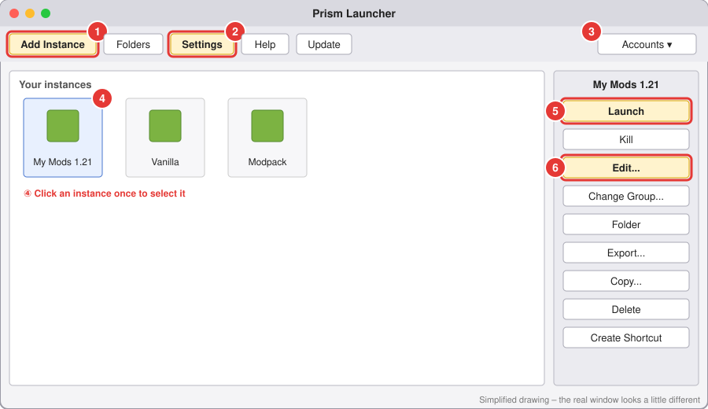
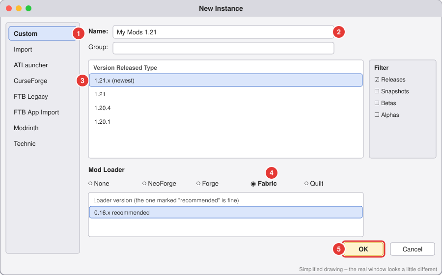

# 3. Make your first instance

⏱️ About 5 minutes, plus download time.

An **instance** is its own separate copy of Minecraft, like a save slot for a whole setup. You can have lots of them (one plain Minecraft, one with mods, one for a modpack...), and they never mix.

## This is the main window

- ① **Add Instance**: make a new instance
- ② **Settings**: accounts, Java, etc.
- ③ **Accounts**: shows who you're signed in as
- ④ Your instances. **Click one once** to select it.
- ⑤ **Launch**: start the game
- ⑥ **Edit...**: mods, worlds and settings for that instance

## Step 1: Open the New Instance window

Click **Add Instance** in the **top-left corner** (① above). A window called **New Instance** opens.

## Step 2: Fill it in

1. On the left, make sure **Custom** ① is selected. It's the first one and selected already.
2. **Name** ②: click the box and type a name you'll recognise, like `My Mods 1.21`.
3. **Version** ③: click the Minecraft version you want in the big list. The top one is the newest.
   - 💡 Playing with mods? Pick the version your mods say they support. If you're not sure, the newest one is usually fine.
   - 💡 Joining a friend's server? Pick **exactly** the same version as the server.
4. **Mod Loader** ④: click **one** round button:

   | Click this... | ...if you want |
   |---|---|
   | **None** | Normal Minecraft, no mods. |
   | **Fabric** | ⭐ **Best for beginners.** Speed mods (Sodium), small helpful mods, shaders (Iris). |
   | **NeoForge** | Big mods that add lots of new stuff (machines, magic, new dimensions) on new versions. |
   | **Forge** | The same kind of big mods, but for **older** versions (1.20.1 and older). |
   | **Quilt** | Only if a mod specifically says it needs Quilt. |

   After you click a loader, a list of **loader versions** appears under it. The one Prism selects (marked **recommended**) is fine, so don't change it.
5. Click **OK** ⑤ in the bottom-right corner.

The window closes and your new instance appears in the main window.

## Step 3: Launch it once

1. Click your new instance **once** to select it (④ in the main window picture).
2. Click **Launch** on the right side (⑤).
3. The first launch takes a few minutes because Prism downloads the game (and Java). A progress bar shows up. Just wait.
4. Minecraft opens. 🎉 Close it again (**Quit Game**) if you want to add mods next.

✅ **Done when:** Minecraft opened from your instance. It's a good idea to launch once *before* adding mods, so you know the plain version works.

## Other buttons on the right (you don't need them yet)

| Button | What it does |
|---|---|
| **Kill** | Force-closes the game if it froze. |
| **Folder** | Opens the instance's files (worlds are in the `saves` folder). |
| **Copy...** | Makes a copy of the instance. Handy before trying risky mods. |
| **Delete** | ⚠️ Deletes the instance **and all its worlds**. |

➡️ Next: [Add mods](04-add-mods.md)
