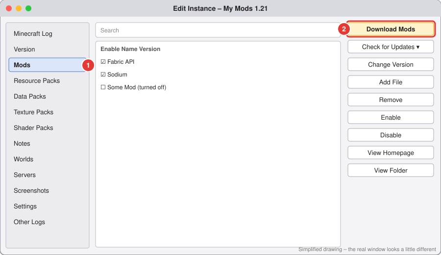
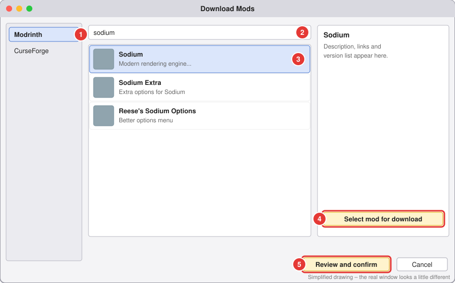

# 4. Add mods (from Modrinth and CurseForge)

⏱️ About 5 minutes.

You **don't** need to visit any website. Prism searches **Modrinth** and **CurseForge** for you and picks the file that matches your instance's Minecraft version and mod loader.

## Step 1: Open the Mods page

1. In the main window, click your instance **once** to select it.
2. Click **Edit...** on the right side.
3. A window called **Edit Instance** opens. In the list on the **left**, click **Mods** ①.

4. On the **right**, click **Download Mods** ②.

## Step 2: Find and pick your mods

1. On the left, click where to search:
   - **Modrinth** ① is selected first. Start here, it has most popular mods.
   - **CurseForge** is right under it. Use it if you can't find a mod on Modrinth.
2. Click the **search box** at the top ② and type the mod's name, for example `sodium`. The results appear by themselves.
3. Click the mod you want in the list ③. Its description shows on the right.
4. Click **Select mod for download** ④ (bottom right). The button changes to **Deselect mod for download**, which means it's picked.
5. Want more mods? Search again and repeat 3–4. You can pick lots of mods before downloading.
6. When you're done picking, click **Review and confirm** ⑤ at the bottom.
7. A list of everything you picked appears. It may also include **dependencies**, other mods your mods need (like **Fabric API**). Keep them! Click **OK**.

Prism downloads everything and you're back on the **Mods** page, where your mods are now in the list with a ☑ tick.

## Step 3: Play

Close the **Edit Instance** window, make sure your instance is selected, and click **Launch**.

✅ **Done when:** the game starts. On the title screen, click **Mods** to see what's loaded (Fabric needs the *Mod Menu* mod for this button).

## 🚫 "Please download the missing mods" (CurseForge only)

Some CurseForge mod makers don't let apps like Prism download their mods. Then Prism shows a window listing those mods, each with a link and **✘ Not Found** in red. It's annoying but easy:

1. Click the **first link**. It opens the mod's page on CurseForge in your browser.
2. Wait for the download to start (or click the **Download** button on that page). The file goes into your normal **Downloads** folder.
3. **Don't close the Prism window.** It watches your Downloads folder, and the mod changes to **✔ Found** in green by itself.
4. Do the same for every link.
5. When all of them say **Found**, click **OK**.

## Mods you downloaded yourself

On the **Mods** page, drag the `.jar` file from your folder into the list, or click **Add File** and pick it. ⚠️ Only use files from **modrinth.com** or **curseforge.com** (see [Stay safe](07-safety.md)).

## Handy things on the Mods page

| I want to... | Do this |
|---|---|
| Turn a mod **off** without deleting it | Click the ☑ tick next to it so it's empty ☐. |
| Delete a mod | Click it, then **Remove**. |
| Update all my mods | Click **Check for Updates**. |

## 5 rules so it doesn't crash

1. ✅ Every mod must be for **the same Minecraft version** as the instance. (Downloading through Prism does this for you.)
2. ✅ Every mod must be for **the same mod loader**. A Fabric mod does **not** work on NeoForge or Forge.
3. ✅ Most Fabric mods need **Fabric API**. Install it once.
4. ❌ Never have **two copies** of the same mod.
5. ❌ Don't mix **OptiFine** with **Sodium**. For shaders on Fabric, use **Sodium + Iris**.

💡 Add a few mods at a time and **launch in between**. If it breaks, you know which mod did it.

➡️ Next: [Install a whole modpack](05-modpacks.md)
